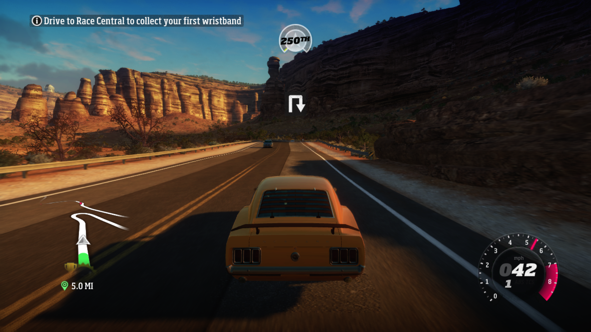
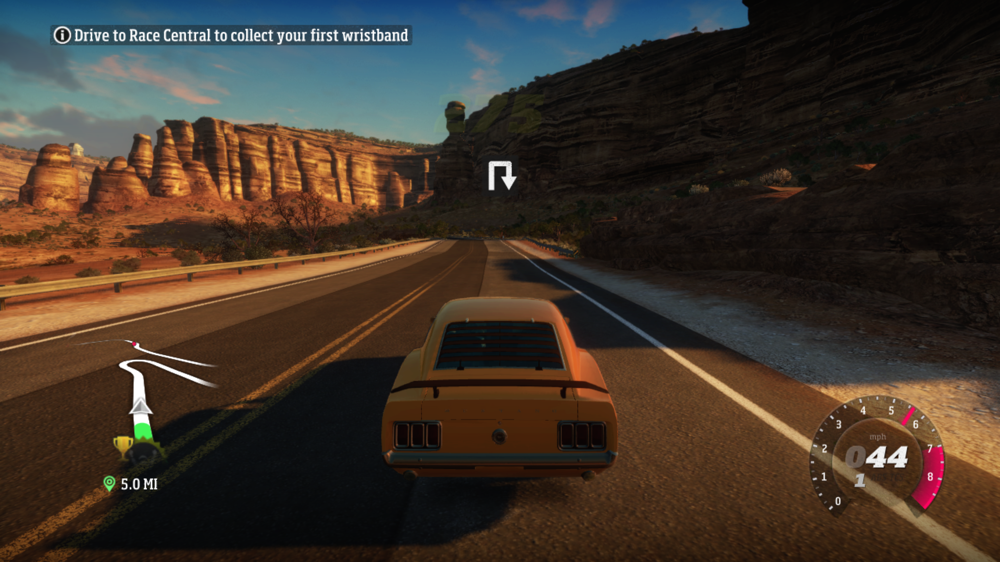

# Upstream proposal: match Xenos normalized point-sample precision

## Suggested commit

```text
fix(rexglue): match Xenos normalized point-sample precision

Round normalized fixed-point texture samples using explicit point filters to
16 fractional bits. Host UNORM sampling may otherwise retain enough extra
precision to move guest threshold comparisons to the wrong side, producing
striped shadow artifacts below vehicles in Forza Horizon.

This is a ReXGlue 0.10 adaptation of the behavior investigated in Xenia Canary
PR #1158. Float formats, linear filtering, and Vulkan are unchanged.

Tests: Release build passed; Forza Horizon gameplay removed the under-car
artifact with no visible regressions in HUD, map, transparency, lighting,
motion blur, or progression.
```

## Suggested pull request title

```text
fix(rexglue): match Xenos normalized point-sample precision
```

## Suggested pull request body

### Summary

This change rounds normalized fixed-point texture samples using explicit point
filtering to 16 fractional bits in the D3D12/DXBC path.

It fixes the striped rectangular shadow artifact rendered below vehicles in
Forza Horizon (Title ID `4D5309C9`). The issue is caused by host normalized
samples retaining more precision than the values exposed by Xenos. In shaders
that compare the sample against a fixed threshold, the small precision
difference can place the comparison on the wrong side.

### Implementation

- Records whether each active texture fetch requests a normalized fixed-point
  result.
- Excludes floating-point texture formats.
- Passes a per-fetch bit mask through the D3D12 system constants.
- Rounds the sampled value to the nearest 16-fractional-bit value.
- Applies the conversion only when mag, min, and mip filters are explicitly
  point-filtered and anisotropic filtering is disabled.
- Increments the DXBC translator version to invalidate incompatible cached
  pipelines.

The implementation intentionally does not affect linear filtering, float
formats, or the Vulkan path.

### Background

The behavior is based on the investigation and game validation in Xenia Canary
PR [#1158](https://github.com/xenia-canary/xenia-canary/pull/1158), which tracks
depth/stencil resolve provenance and applies equivalent Q16 rounding to
normalized point samples from those resolves.

ReXGlue 0.10 predates the texture integer-scaling and depth-resolve provenance
infrastructure used by that PR. This adaptation therefore uses the narrower
set of information currently available in ReXGlue: normalized fixed-point
format plus explicit point filtering.

The earlier Xenia Canary PR
[#1155](https://github.com/xenia-canary/xenia-canary/pull/1155) is not used. It
altered depth-only stencil precision and could hide the artifact by suppressing
ambient occlusion rather than correcting the sampled precision.

### Validation

- ReXGlue SDK Release build: passed.
- Pinyon Shift Release build: passed.
- Reproducible patch series: passed from the pinned ReXGlue commit with all 38
  patches applied in order.
- Forza Horizon main menu and save loading: passed.
- Open-world gameplay: passed.
- Vehicle collision and event gameplay: passed.
- Under-car striped artifact: fixed.
- Visible regressions in HUD, map, transparency, lighting, motion blur, FMVs,
  or world rendering: none observed.

Test environment:

- Game: Forza Horizon, Title ID `4D5309C9`, Media ID `2DC7007B`.
- ReXGlue: `v0.10.0`, pinned commit
  `f5337cdc947ff6d4c4196737e2c807a48f2a1fc2`.
- Renderer: D3D12.
- GPU: NVIDIA GeForce RTX 5070.
- OS: Windows.

### Scope and follow-up

This patch is suitable for validating and fixing the behavior on the current
ReXGlue 0.10 codebase. A future general implementation may port Xenia's
depth-resolve provenance tracking and restrict rounding specifically to
textures whose complete backing range originated from a depth/stencil resolve.

### Files

The proposed source change is contained in:

```text
patches/rexglue/0038-round-normalized-point-samples-to-xenos-q16.patch
```

### Visual evidence

The captures below use the same open-world route, chase camera, vehicle, and
gameplay presentation. The unpatched renderer produces a large dark/striped
texture under the moving vehicle; with this patch, that texture is absent while
the expected vehicle shadow remains.

Before (unpatched):



After (patched):


